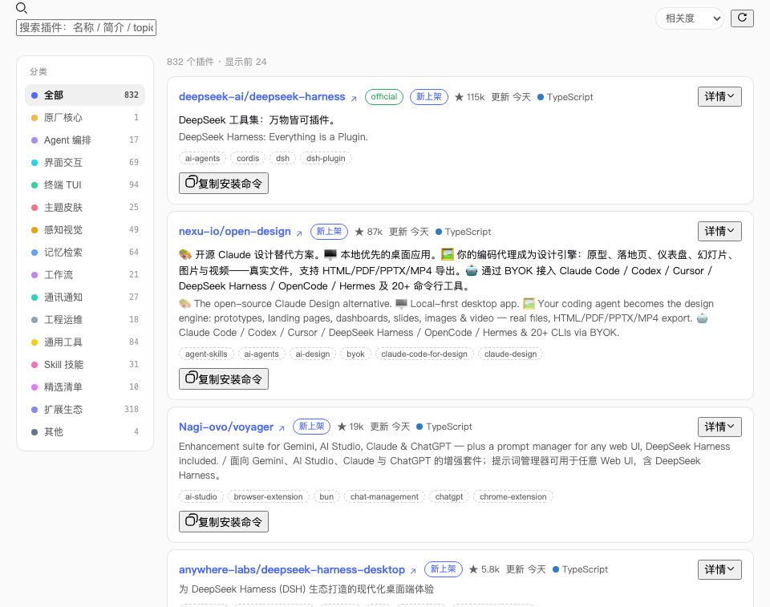
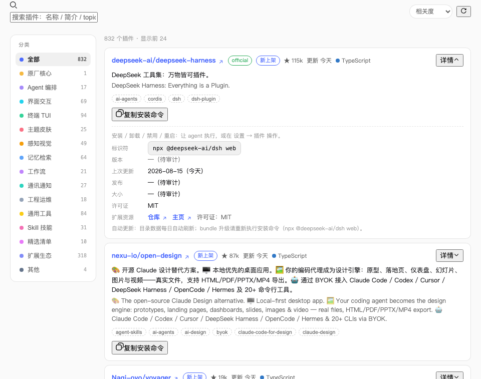
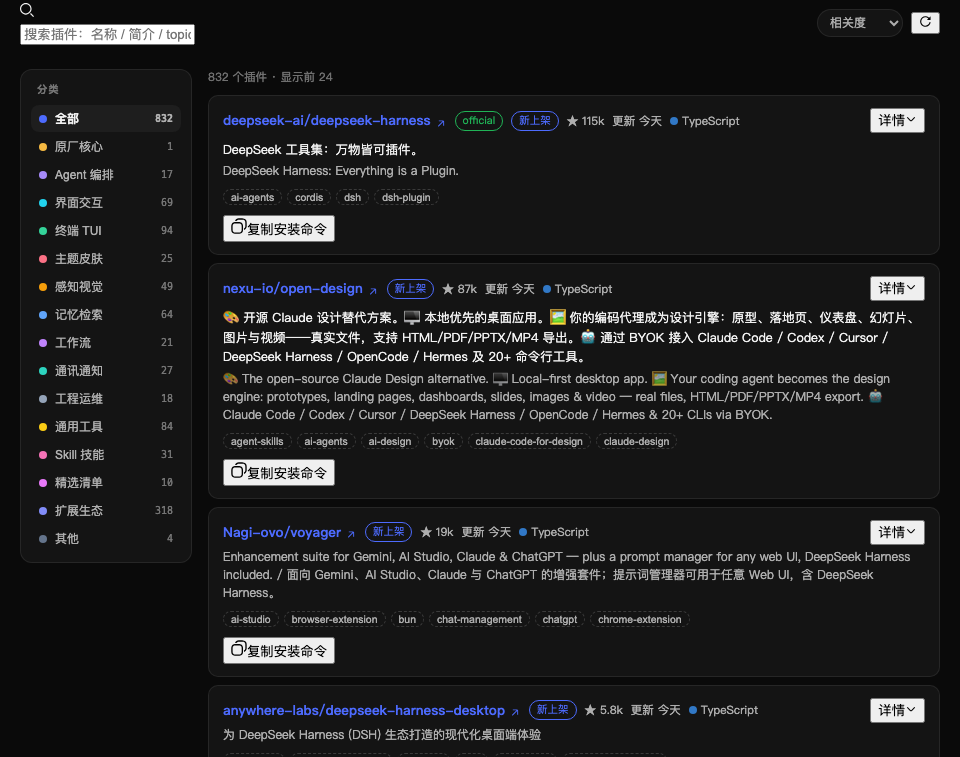

<div align="center">

<h1>DSH Workshop · Everything is a plugin — equip your DSH now</h1>

<p>A community corner around <a href="https://github.com/deepseek-ai/deepseek-harness">DeepSeek Harness (dsh)</a></p>

<p><a href="README.md">简体中文</a> · <b>English</b></p>

<p>
  <a href="https://github.com/deepseek-ai/deepseek-harness"></a>
  
  
  
  
</p>

<p>
  <a href="#quick-start">Quick Start</a> ·
  <a href="#dsh-manual">DSH Manual</a> ·
  <a href="#plugin-aggregation">Plugin Aggregation</a> ·
  <a href="#deployment">Deployment</a>
</p>

</div>

---

Two sections, one site, plus an installable dsh plugin:

- **Plugin Library** — Hand-picked projects from the DeepSeek Harness ecosystem, organized by use case (left category sidebar); every item lists its install method, with Chinese notes alongside English descriptions.
- **DSH Manual** — A tutorial organized along the learning path: get your first task running, then turn repeated work into your own AI workflow. Collapsible chapters with copyable conversation examples.
- **dsh-plugin-hub plugin** — The [`plugin/`](plugin/) directory is a complete dsh bundle: once installed into any dsh, the agent gains three tools — `plugin_search` / `plugin_info` / `plugin_install` (discover → verify → approval-gated install), and the Web UI gains a "Plugins" tab in the session view. See [`plugin/README.en.md`](plugin/README.en.md).

## ✨ Features

- **Static, zero backend** — A Vite-built SPA; drop `dist/` onto any static host
- **Self-updating** — GitHub Actions scheduled aggregation + push triggers → build → auto-deploy, fully unattended
- **Plugin-first layout** — Category sidebar + card flow, two-column architecture
- **Hardened** — Global ErrorBoundary, schema validation, zero hardcoded secrets, rate-limit retries, deploys as a downgraded user
- **SEO ready** — canonical, JSON-LD structured data, og:image share card, `robots.txt`, `sitemap.xml`, noscript fallback
- **No extra dependencies** — Aggregation scripts use only Node 18+ built-in `fetch`; tests use the built-in test runner
- **Bilingual** — UI and tutorial content switch between Chinese and English, preference persisted locally
- **Official design language** — `#0a0a0a` black base + white opacity scale + DM Sans, matching deepseek.com/harness

---

## The dsh-plugin-hub Plugin

[`plugin/`](plugin/) packages this site's plugin aggregation into a bundle any dsh user can install (plain JavaScript ESM, no build step, no pnpm build authorization needed):

```bash
dsh plugin --profile myhub add "github:qomob/dsh#path:/plugin"
dsh --profile myhub
# Then tell your agent: "Use plugin_search to find a dsh desktop-notification plugin"
```

- **`plugin_search`** — Keyword / category search over the dsh community ecosystem (offline embedded snapshot, 328+ plugins, + daily runtime auto-refresh; optional live GitHub search), returning install commands
- **`plugin_info`** — Details for one plugin repo + install verification (manifest facts, build-script risks, monorepo subpath hints)
- **`plugin_install`** — Agent-driven install: verify the target → interactive approval in the Web UI (explicit `confirm` when no approval service) → run `dsh plugin add`; pnpm authorization failures get an allowBuilds fix hint
- **"Plugins" tab** — Session view ring (Chat / Trajectory / Plugins): browse, search, filter by category, copy install commands; works offline, auto-refreshes online, follows the theme

### 📸 UI Preview

The "Plugins" tab (session view ring: Chat / Trajectory / **Plugins**):

| Catalog (light) | VS Code-style detail (light) | Catalog (dark) |
|---|---|---|
|  |  |  |

Data refreshes daily: CI collects new plugins at 08:00 (Beijing) and refreshes `plugin/data/registry.json` and `plugin/client.js`; installed plugins pull the latest snapshot every 24 hours in the background (failures silently keep the current snapshot) — no reinstall needed. Configuration (GitHub token, mirrors, limits, timeouts, refresh/install switches) and development notes are in [`plugin/README.en.md`](plugin/README.en.md).

---

## Quick Start

### Requirements

- Node.js 18 LTS or later
- npm 9+

### Local Development

```bash
git clone https://github.com/qomob/dsh.git
cd dsh
npm install
npm run dev      # → http://localhost:5173
```

### Commands

| Command | Description |
|---|---|
| `npm run dev` | Start the dev server (HMR) |
| `npm run build` | Production build to `dist/` |
| `npm run preview` | Preview the build locally |
| `npm test` | Unit tests for pure functions (built-in test runner, zero deps) |
| `npm run lint` | oxlint static checks |
| `npm run aggregate` | Run the aggregation pipeline manually |

---

## DSH Manual

A beginner's manual in four progressive parts (collapsible, all collapsed by default):

| PART | Topic | For whom | Color |
|---|---|---|---|
| **01** Zero to One | Install & launch, tour the UI, first task | Complete beginners | 🔵 Blue |
| **02** Real Cases | Code, docs, vision, automation, debugging | Want more after the first run | 🟢 Green |
| **03** Advanced | Writing plugins, CLI/SDK, multi-agent, automation | Developers | 🟣 Purple |
| **04** Production | Role tracks, industry use, community | Taking it to work | 🟡 Gold |

Reading experience:

- **PART-level collapse** — All four parts collapse to compact single lines by default; click to expand
- **Copyable examples** — Case chapters include full prompts to paste and try
- **Advanced content folding** — `——` separators tuck advanced notes into small gray blocks
- **Top progress bar** — Live "where am I" feedback while reading long chapters

Manual data lives in [`src/data/blueprint.js`](src/data/blueprint.js), structured bilingually.

---

## Plugin Aggregation

The aggregation scripts live in [`scripts/aggregate/`](scripts/aggregate/) with zero extra dependencies (Node 18+ built-in `fetch` only).

### Pipeline

```
GitHub Search API (three whitelisted topics)
    ↓
Merge awesome curated lists (README extraction + topic whitelist)
    ↓
Deduplicate (by fullName)
    ↓
Relevance scoring (official boost + topics + stars + activity)
    ↓
Relevance filter (description must mention dsh / DeepSeek Harness)
    ↓
Auto-categorize (16-category regex inference)
    ↓
LLM translation (OpenAI-compatible, optional)
    ↓
Schema validation → write src/data/repos.json
```

### Manual Run

```bash
# Environment variables
export GH_TOKEN=ghp_xxx                    # GitHub token (recommended, 5000 req/h)
export LLM_API_KEY=sk-xxx                  # Optional, for translation (OpenAI-compatible)
export LLM_API_BASE=https://api.deepseek.com  # Optional, defaults to DeepSeek
export LLM_MODEL=deepseek-chat             # Optional, defaults to deepseek-chat

npm run aggregate
```

### Environment Variables

| Variable | Required | Default | Description |
|---|---|---|---|
| `GH_TOKEN` | Recommended | Anonymous 60/h | GitHub token, raises the quota to 5000/h |
| `LLM_API_KEY` | Optional | Skip translation | Key for any OpenAI-compatible API |
| `LLM_API_BASE` | Optional | `https://api.deepseek.com` | OpenAI-compatible endpoint |
| `LLM_MODEL` | Optional | `deepseek-chat` | Translation model name |

### Data Reliability

- **Rate-limit aware retries** — Search/enrichment waits for reset instead of failing
- **Topic whitelist** — Only repos tagged `dsh-plugin` / `dsh` / `deepseek-harness` are collected
- **Relevance filter** — Descriptions must actually mention dsh / DeepSeek Harness; drive-by repos are dropped
- **Schema validation** — Non-empty `repos`, required fields, valid URLs asserted before writing; invalid data aborts (protecting the last good snapshot)
- **Translation degradation** — Without an LLM key, originals are kept gracefully
- **Unit tests** — Category/scoring/extraction/formatting pure functions are covered (36 cases)

---

## GitHub Actions

[`.github/workflows/daily-aggregate.yml`](.github/workflows/daily-aggregate.yml) runs automatically:

```
Aggregate data → commit (when changed) → build → rsync deploy → upload artifacts
```

Triggers:

- **Schedule** — Daily at 08:00 Beijing time
- **push** — To main (excluding repos.json data commits to avoid recursion)
- **Manual** — Actions tab → Run workflow (with optional "force deploy")

### Secrets

Repo **Settings → Secrets and variables → Actions**:

| Secret | Description |
|---|---|
| `GH_TOKEN` | PAT (classic, read-only `public_repo`), raises quota |
| `LLM_API_KEY` | Translation API key (OpenAI-compatible) |
| `LLM_API_BASE` | Translation endpoint (defaults to DeepSeek) |
| `LLM_MODEL` | Translation model (defaults to deepseek-chat) |
| `SSH_HOST` / `SSH_USER` / `SSH_PRIVATE_KEY` / `DEPLOY_PATH` | SSH config for auto-deploy |

---

## Deployment

The build output is pure static files (`dist/`), deployable to any static host.

### Option 1: BT Panel (Alibaba Cloud etc., current production)

Live at: **https://dsh.qomob.ai** (BT Panel + Nginx + HTTPS).

See [`DEPLOY-BAOTA.md`](DEPLOY-BAOTA.md) (Chinese) for full Nginx config, HTTPS setup, hardening checklist, and automation.

Core Nginx config:

```nginx
root /www/wwwroot/dsh.qomob.ai;
index index.html;

location / {
    try_files $uri $uri/ /index.html;   # SPA fallback
}

location ~* \.(js|css|svg|png)$ {       # Long-lived static caching
    expires 30d;
    add_header Cache-Control "public, immutable";
}

location = /index.html {                # Never cache the entry
    add_header Cache-Control "no-cache";
}
```

### Option 2: Vercel / Netlify / Cloudflare Pages

| Item | Value |
|---|---|
| Framework preset | Vite |
| Build command | `npm run build` |
| Output directory | `dist` |
| Node version | 18 or later |

### Option 3: GitHub Pages

Push `dist/` to a `gh-pages` branch, or pick GitHub Actions deployment under Settings → Pages.

### Deployment Checklist

- [ ] `npm run build` passes
- [ ] `npm test` all green (36 tests)
- [ ] `src/data/repos.json` non-empty with a recent `generatedAt`
- [ ] After deploy, `https://your-domain/robots.txt` and `/sitemap.xml` respond
- [ ] SPA fallback configured at the hosting layer
- [ ] HTTPS enabled (required for social share previews)
- [ ] Verify OG meta with [opengraph.xyz](https://www.opengraph.xyz/)

---

## Directory Layout

```
.
├── src/
│   ├── components/           # React components
│   │   ├── ErrorBoundary.jsx     # Global error boundary (no white screens)
│   │   ├── Navbar.jsx           # Navbar + language switch
│   │   ├── Hero.jsx             # First screen + code sample + CTA
│   │   ├── StatsBar.jsx         # Stats strip
│   │   ├── HubSection.jsx       # Plugin hub (category sidebar + card flow + Top 10)
│   │   ├── BlueprintSection.jsx # DSH Manual (collapsible PARTs + progress bar)
│   │   ├── RepoCard.jsx         # Plugin card
│   │   └── Footer.jsx
│   ├── data/
│   │   ├── blueprint.js         # Manual data (bilingual, 30 chapters)
│   │   └── repos.json           # Aggregation output (auto-updated daily)
│   ├── i18n/
│   │   ├── LanguageContext.jsx  # Language context + persistence
│   │   └── ui.js                # Bilingual UI copy
│   ├── lib/
│   │   ├── categories.js        # 16 categories + auto-inference
│   │   └── format.js            # Number/date/language color formatting
│   ├── App.jsx
│   ├── main.jsx
│   └── index.css               # Tailwind v4 theme (official design tokens)
├── scripts/aggregate/         # Daily aggregation pipeline (zero deps)
│   ├── config.mjs             # Search keywords + awesome sources + output path
│   ├── github.mjs             # GitHub API wrapper (rate-limit aware)
│   ├── awesome.mjs            # Awesome-list README extraction
│   ├── translate.mjs          # LLM translation (OpenAI-compatible, degradable)
│   └── aggregate.mjs          # Main flow (dedupe/filter/schema validation)
├── plugin/                    # dsh-plugin-hub: installable dsh bundle
│   ├── index.js               # Plugin entry (Config + defineTool tools)
│   ├── cordis.patch.yml       # Bundle layer (referenced by dsh.bundle in package.json)
│   ├── src/                   # categories / registry / live / install / refresh / format
│   ├── data/registry.json     # Embedded snapshot (CI daily + runtime daily pull)
│   ├── tests/                 # 44 unit tests (node:test, no network)
│   └── smoke/                 # End-to-end smoke (real cordis + dsh-tools pipeline)
├── tests/unit.test.mjs        # Pure-function unit tests (36 cases)
├── public/                    # Static assets
│   ├── favicon.svg
│   ├── icons.svg
│   ├── og-image.png           # Social share card 1200×630
│   ├── robots.txt             # SEO
│   └── sitemap.xml            # SEO
├── .github/workflows/         # CI scheduled job + auto-deploy
│   └── daily-aggregate.yml
├── DEPLOY-BAOTA.md            # BT Panel deployment guide (Chinese)
└── LICENSE                    # MIT
```

---

## Tech Stack

| Layer | Tech | Notes |
|---|---|---|
| Framework | React 19 + Vite 8 | SPA, data inlined at build |
| Styling | Tailwind CSS v4 | Matches DeepSeek's official design tokens |
| Data | GitHub Search API + awesome lists | Scheduled aggregation → `repos.json` |
| Translation | LLM API (OpenAI-compatible) | Optional; degrades to original text |
| CI | GitHub Actions | Scheduled + push triggers, rsync deploy |
| Checks | oxlint + node:test | Zero-dependency lint + tests |

---

## Contributing

Issues and PRs welcome:

- Content fixes / manual additions → edit `src/data/blueprint.js`
- Add aggregation sources → edit `SEARCH_QUERIES` and `AWESOME_SOURCES` in `scripts/aggregate/config.mjs`
- Adjust category rules → edit `src/lib/categories.js` (covered by tests; run `npm test` after changes)
- Bug fixes → include reproduction steps; pure functions with test coverage get priority

Before developing:

```bash
npm install
npm test && npm run lint && npm run build   # All green before committing
```

---

## 💬 Join the Community

Scan the QR code to join the DSH Workshop WeChat group — chat about dsh usage, plugin development, and best practices:

<div align="center">


</div>

> WeChat QR codes expire; if it fails to scan, leave a note in [Issues](https://github.com/qomob/dsh/issues) and we'll refresh it.

---

## Disclaimer

This is a community-driven unofficial project with no affiliation with DeepSeek AI. "DeepSeek", "dsh", "DeepSeek Harness" and related names/trademarks belong to their respective owners.

---

<div align="center">

**MIT License · © 2026 Qomob.AI**

 Build in public · Everything is a plugin — equip your DSH now

</div>
